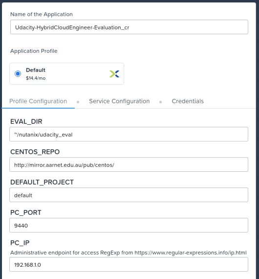

# Evaluation Script for Udacity HCE Student Blueprints

Please use this script to evaluate student blueprints.

## Evaluation App Deployment Instructions

- Obtain a copy of this repository from GitHub.

  Users with access to an environment with `git` already installed, this can be done with the following command.

  ```
  git clone https://github.com/nutanixdev/udacity.git
  ```

  Users that prefer to download this repository using a web browser may follow these steps.

  - Browse to [https://github.com/nutanixdev/udacity.git](https://github.com/nutanixdev/udacity.git)
  - Click the `Code` button and select `Download ZIP`, as shown in the screenshot below.

    

- Login to Prism Central using the provided credentials
- On the left side of the Prism Central UI, open Nutanix Calm by clicking the "bars" icon, selecting `Services` and clicking `Calm`

  

- When Nutanix Calm opens, select the **Blueprints** button on the left side of the Prism Central UI

  

- Click **Upload Blueprint**

  

- Browse to the location of this repository on your local workstation and select `blueprints/UdacityEval_20200929.json`

  

  - Because blueprint names must be unique, it is suggested to use **Udacity_20200929_<initials>**, with **<initials>** replaced by **your** initials
  - The **Project** field may be different for all environments
  - Enter `nutanix4/u` for the **Passphrase**
  - Click **Upload**

  If the upload process is successful, you will be taken directly to the Nutanix Calm blueprint designer for the upload blueprint

- Click the **Launch** button

  

- Complete all fields that can be modified

  - Enter an Application name
  - **EVAL_DIR**: Leave as default, unless you need to change the evaluation directory within the deployed virtual machine
  - **CENTOS_REPO**: Leave as default, unless your environment requires troubleshooting of CentOS package repositories
  - **DEFAULT_PROJECT**: Set this to the name of your Nutanix Calm project, as used when uploading the blueprint in previous steps
  - **PC_PORT**: Leave as default
  - **PC_IP**: Enter the IP address for your Prism Central instance - note this is the **IP Address** only, not the URL

  For example only:

  

  - Click **Service Configuration** and click **UdacityEval**

    

  - Scroll towards the lower part of the deployment settings and ensure the **NIC 1** field is set to a network available in your environment

    

  - Click **Credentials** and click **PC_Credentials**

  - Enter the username and password for **your** Prism Central instance

    

  - Click **Create**

    

  - Wait for the Udacity Eval application to finish deploying.  Nutanix Calm will need to download the CentOS 7 disk image and update Linux packages - this may take some time.  A succesful deployment will be indicated by all steps showing as **Finished** and an application state of **RUNNING**.

    

  - Click the **Services** tab and select the single service that has been deployed

    

  - On the right side of the Nutanix Calm UI, take note of the service's **IP Address**.  An example is shown below - your service's IP address will be different

    

## Student Blueprint Evaluation Instructions

- Obtain exported Nutanix Calm blueprint(s).  The blueprints must be **exported** from the Nutanix Calm UI and not decompiled using the Calm DSL (the JSON output is different between each method).

  Each blueprint will be a single JSON document, when exported correctly.

## Script Usage


Script help:

    Usage: eval.bash [ARGS]

    Args:
      -h  Show this help and exit.
      -d  Location of user blueprints
      -b  Blueprint name to evaluate
      -c  Evaluation criteria file to use for comparison

    Note:
      -b  value can be "all", to batch process all JSON blueprints in the specified directory

    Examples:
      eval.bash -c eval.json -d ~/blueprints -b blueprint1
      eval.bash -c eval.json -d . -b all
